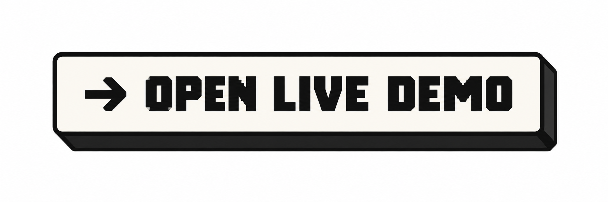

<p align="center">
  
</p>

<p align="center">
  <strong>Product scoping system</strong><br />
  Turn ambitious product ideas into credible, human-approved scope.
</p>

<p align="center">
  <code>CONTEXT</code> &rarr; <code>UNDERSTAND</code> &rarr; <code>CLARIFY</code> &rarr; <code>NEGOTIATE</code> &rarr; <code>LOCK</code>
</p>

<p align="center">
  <a href="https://www.scopenegotiator.com/" target="_blank" rel="noopener noreferrer">
    
  </a>
</p>

---


## The problem

Ambiguous or ambitious feature requests and product ideas routinely contain hidden assumptions, unresolved questions and scope that does not match the team or time available.

The usual response is either a confident-sounding specification built on guesswork, or an open-ended planning process that never converges.

Scope Negotiator takes a different position: uncertainty should remain visible. The model analyses what is known, assumed, unknown and high-risk, then proposes a scope breakdown. The human reviews, overrides and locks.

**AI proposes. You decide.**

## How it works

**Context** - Collect the product or feature brief, team capacity, timeframe and hard constraints. Mode-specific flows for new products vs. features on existing products.

**Understand** - The model categorises observations as Known, Assumed, Unknown or High Risk. No invented certainty. If something is genuinely unknown, it stays unknown.

**Clarify** - Up to three clarification questions, only where the answer could materially change scope. Zero questions is a valid result. Answers are treated as authoritative input to the next stage. Users can skip questions entirely; unanswered questions remain unresolved rather than being silently filled.

**Negotiate** - Scope items are proposed with Ship / Negotiate / Cut classifications, each with effort, risk and reasoning. Items must represent genuine deliverables, not planning activities. These are recommendations. The user moves items between columns freely. Overrides are tracked.

**Lock** - Two-column final document: the human-approved scope with audit trail on the left, context summary on the right. Success criteria are filtered against the final ship scope so deferred capabilities do not appear as requirements. Users can return to Negotiate, change classifications, and re-lock. Exportable as Markdown.

## Engineering approach

The architecture follows one principle:

> Deterministic shell. Probabilistic core.

The model handles ambiguous reasoning about product scope. Everything else is ordinary, predictable application code.

The model never owns consequential application state. Specifically, the application is responsible for:

- Workflow state and stage transitions
- Request and response validation
- All IDs (insights, questions, scope items)
- Current classification (initially mirrors the model recommendation)
- User override tracking
- Error handling and retry behaviour
- The final locked representation

The model returns structured proposals. The application decides what becomes state.

## AI pipeline

```
User input
     |
Request validation (Zod)
     |
Server-side model call (Next.js API route)
     |
Forced tool use (structured output)
     |
Response schema validation (Zod)
     |
Domain mapping (add IDs, application-owned fields)
     |
Application state (React reducer)
```

Two API routes handle model interaction:

- `/api/analyze` - receives `ScopeContext`, returns validated `ScopeAnalysis`
- `/api/propose` - receives `ScopeContext` + `ScopeAnalysis` (with human answers), returns validated `ScopeProposal`

Both routes validate incoming request bodies before calling the provider and validate model responses before returning them to the client.

The provider adapter (`src/lib/ai/provider.ts`) uses Anthropic's tool use with forced tool choice to obtain structured JSON. The model is required to call a tool whose `input_schema` matches the Zod schema, and the response is parsed and validated before leaving the server. Swapping provider means changing one file.

### Behavioural rules encoded in prompts

- Never replace ambiguity with generated certainty
- Do not invent missing requirements, team capabilities or technical constraints
- Distinguish supplied facts from model inference
- Preserve meaningful unresolved uncertainty
- Only ask clarification questions whose answers could materially change scope
- Human clarification answers are authoritative
- Scope items must be deliverables, not planning activities
- Skipped clarification questions remain unresolved, not silently answered

## Guardrails

- Model credentials remain server-side (API routes, not browser)
- Incoming client requests are validated against Zod schemas before reaching the provider
- Model responses are validated against bounded schemas before entering application state
- Output is bounded: max 10 insights, max 3 questions, max 12 scope items, max 8 success criteria
- Invalid model output is rejected, not silently accepted
- Raw provider errors are not exposed to the browser
- Failures preserve all entered context and revert to the last actionable stage
- Retry clears the error state without destroying user input
- Classification is always a recommendation; overrides are application-owned
- Success criteria are filtered against the final ship scope at lock time
- Lock-then-edit-then-re-lock recomputes everything from current state
- Missing API key returns a clear 503 before reaching the provider
- AI endpoints are rate-limited per IP (10 requests/minute) with clear 429 messaging

## Design

The interface changes density to match the cognitive task:

| Stage      | Density       | Rationale                    |
| ---------- | ------------- | ---------------------------- |
| Context    | Spacious      | Thinking and composing       |
| Understand | Structured    | Reading and absorbing        |
| Clarify    | Focused       | Answering specific questions |
| Negotiate  | Dense         | Comparing and deciding       |
| Lock       | Authoritative | Reviewing a decision         |

Motion is minimal and purposeful. Transitions confirm state changes rather than announcing that elements exist. Physical controls use hard-shadow press states. `prefers-reduced-motion` is respected globally.

## Tech stack

- **Next.js 16** - App Router, API routes for server-side model calls
- **React 19** - `useReducer` + Context for workflow state, no state library
- **TypeScript** - strict mode
- **Zod 4** - request validation, response schema validation, JSON Schema generation
- **Anthropic SDK** - Claude via forced tool use for structured output (model configurable via env var)
- **Auth.js v5** - Credentials provider, JWT sessions, middleware-protected routes
- **Drizzle ORM + Turso** - hosted SQLite for user and workspace persistence
- **CSS Modules** - no UI library, no Tailwind

## Running locally

```bash
git clone https://github.com/reuben-stone/scope-negotiator.git
cd scope-negotiator
npm install
```

Create `.env.local`:

```
ANTHROPIC_API_KEY=your-key-here
ANTHROPIC_MODEL=claude-sonnet-4-5-20250929   # optional, defaults to this value

# Auth
AUTH_SECRET=your-auth-secret

# Database (Turso)
TURSO_DATABASE_URL=your-turso-url
TURSO_AUTH_TOKEN=your-turso-token
```

```bash
npm run dev     # development server
npm run build   # production build
npm start       # serve production build
```

The core scoping flow works without auth or database credentials. Authentication and workspace features require the auth and database environment variables.

## Testing

No formal test suite or AI evaluation framework exists yet.

The implementation can be evaluated by running different kinds of briefs through the full flow:

- A well-defined brief with clear constraints
- An ambiguous brief with missing information
- An unrealistic brief (large scope, small team, short timeframe)
- A brief that is already sensibly scoped

Useful things to verify: Does the model identify genuine unknowns rather than inventing answers? Do clarification questions target decisions that would change scope? Are classifications defensible? Does a 0-question analysis work correctly?

## Persistent Workspace context

Authenticated users can store reusable Product Context, Team Context and explicitly approved Memory.

When a new scope begins, reusable context is copied into the active workflow as an editable snapshot. Changes made during that scope do not silently mutate the saved Workspace defaults.

Locked scopes preserve the context actually used during the decision, so historical scope records remain accurate even if Workspace defaults later change.

AI may propose durable memories after a scope is locked, but only explicit human approval can persist them.

> Workspace context is a default. Scope context is a snapshot. Locked context is history.

## Current state

**Fully functional:**

- Complete five-stage scoping workflow (Context &rarr; Understand &rarr; Clarify &rarr; Negotiate &rarr; Lock)
- Reducer-driven stage transitions (single page, no URL routing within flow)
- AI analysis and proposal via server-side Anthropic API calls
- User registration, authentication and workspace creation
- Scope persistence - auto-save on lock, upsert on re-lock
- Product Context - saved products selectable when scoping new features
- Team Context - saved team/capacity selectable during delivery step
- Memory - AI proposes, human approves, persists across sessions
- Markdown export of locked scope documents
- Back navigation and re-lock flow
- Responsive mobile layout with compact workspace navigation

**Not yet built:**

- Integrations - no Jira, Linear, Notion or similar
- Vector search / RAG - the model works from the supplied brief alone
- Multi-agent orchestration - single model, three calls (analyze, propose, memory)
- Streaming - responses are short enough that streaming adds complexity without UX benefit
- Model selection UI - one model, server-configured
- Scope history - compare how scope evolved across iterations
- Feedback loop - compare scoped effort vs. actual

## Product principles

> "Never replace ambiguity with generated certainty."

> "AI proposes. Humans decide. Software remembers."

> "Workspace context is a default. Scope context is a snapshot. Locked context is history."

---

Built by [Reuben Stone](https://github.com/reuben-stone)
